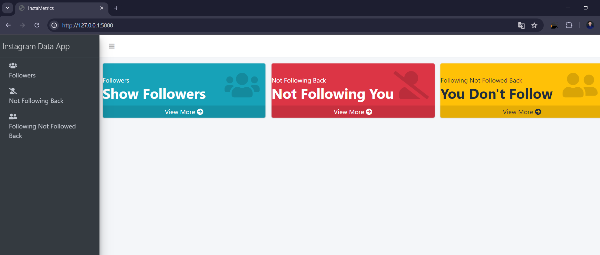
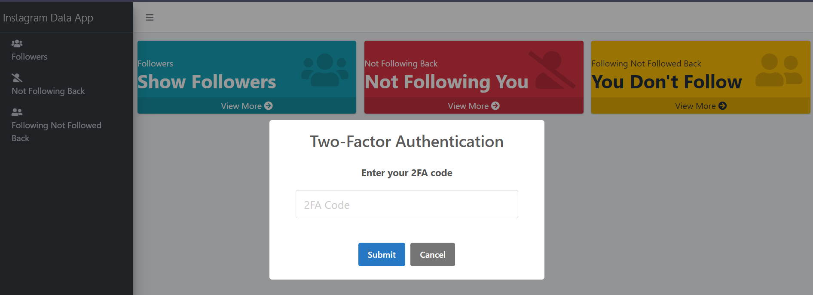

# InstaMetrics

InstaMetrics is a web application developed using Python and Flask. It focuses on retrieving and analyzing Instagram metrics such as followers, users not following back, and more. The application provides tools for efficient management and insights into Instagram follower dynamics, enhancing user experience with its intuitive interface and robust functionality.

## 1. Features:

### a. Functionality:

- Retrieve Followers: View a list of your Instagram followers.
- Users Not Following Back: Identify users you follow who don't follow you back.
- Following Not Followed: See users who follow you but you don't follow back.
- Two-Factor Authentication: Support for Instagram's two-factor authentication for secure login.

### b. Setup:

#### Clone the Repository:

        https://github.com/netto14cr/InstaMetrics.git

#### a. Environment Variables:
Create a .env file in the project root and add your Instagram credentials:

        INSTAGRAM_USERNAME=your_instagram_username
        INSTAGRAM_PASSWORD=your_instagram_password

#### b.Install Dependencies:
        python -m venv env
        source env/bin/activate  # For Linux/Mac
        .\env\Scripts\activate   # For Windows
        pip install -r requirements.txt

#### c. Running the Application:
        python app.py

## 1. Usage:

### a. Logging In:

- Navigate to /login to authenticate with your Instagram credentials.
- If two-factor authentication is required, you'll be prompted to enter the code.

### b. View Metrics:

- /followers: Displays your Instagram followers.
- /not_following_back: Lists users you follow but who don't follow you back.
- /following_not_followed: Shows users who follow you but who you don't follow back.

### c. Technologies Used::

- Python
- Flask
- Instaloader
- Bootstrap
- HTML/CSS.

## 2. Screenshots:

## 3. More information:
*This project is licensed under the MIT License - see the LICENSE file for details.*
